# Hybrid GI architecture and source mapping

Reference: AMD Capsaicin commit `914b91596cd119eda85fbc1d3c7ee6ac391b1452`,
[`src/core/src/render_techniques/gi1`](https://github.com/GPUOpen-LibrariesAndSDKs/Capsaicin/tree/914b91596cd119eda85fbc1d3c7ee6ac391b1452/src/core/src/render_techniques/gi1).
Rust handles Bevy integration and GPU lifetime; WGSL supplies computation.
This does not wrap Capsaicin. Correspondences below describe implemented concepts;
the [parity inventory](gi12-parity.md) identifies the remaining upstream mechanisms.

## Reference correspondence

| Upstream mechanism | Rust/WGSL implementation |
|---|---|
| `gi1.cpp` orchestration | `gpu.rs`: nineteen base stages, including three indirect-argument preparation stages, plus up to four spatial passes |
| Probe spawn/reproject/patch | Jittered tile placement, second incompatible surface slot, compatible old-layer reuse |
| Probe sample/populate | Uniform hemisphere bins mixed with radiance-guided history, compensated mixture PDF |
| Probe blend/sample recovery | Directional radiance and hit distance, temporal accumulation, endpoint-based parallax redistribution |
| Probe compaction | Active probe list and indirect dispatch; fixed reserved capacity |
| SH projection | Nine real SH coefficients, separate filtered coefficients, cosine-convolved diffuse gather |
| Hash-grid insert/find/expiry | Camera-distance-scaled cells, full descriptor/material/normal/plane validation, bounded hash search, expiry |
| Cell population / world-space ReSTIR | Eight fresh alias candidates, previous-frame temporal/four-neighbor reservoir reuse, one selected shadow ray |
| Multibounce population/update | Extra diffuse ray at compacted primary cells, separate direct/indirect estimators, next-frame staged indirect estimate |
| GI reconstruction/denoising | Compatible probes, screen-continuity checks, bilinear history, moments, clipping, demodulated spatial filtering |
| Reflection trace/reconstruction | GGX VNDF/mirror rays, rough probe reuse, material checks, temporal-variance clipping |
| Hardware ray tracing | `raytracing.rs`/`raytracing.wgsl`: Vulkan BLAS/TLAS and alpha-tested ray queries; software stackless BVH alternative |

The flat cache, two-layer allocation, reservoir schedule and reflection filters
differ from upstream. Tiled/mipmapped hash caches, complete persistent probe
relocation, streamed light grids, reflection virtual-hit reprojection, ratio
estimators and the full upstream denoiser remain absent. AMD's MIT notice is
preserved in `THIRD_PARTY_NOTICES.md`.

## Frame flow

```mermaid
flowchart LR
    G[Bevy depth and deferred G-buffer] --> P[Spawn/reproject and compact probes]
    P --> T[Trace guided probe rays]
    T --> C[Register and compact first-hit cells]
    C --> B[Trace extra diffuse bounce]
    B --> S[Register and compact touched cells]
    S --> L[Generate light reservoirs]
    L --> D[Update direct and prior indirect estimates]
    D --> Q[Stage new extra-bounce estimate]
    Q --> R[Resolve probe radiance and SH]
    R --> PF[Filter compatible probes and SH]
    PF --> U[Gather diffuse and primary emissive MIS]
    PF --> F[Trace glossy rays or reuse rough probes]
    U --> H[Reconstruct history and moments]
    F --> H
    H --> A[Variance-guided spatial passes]
    A --> O[Apply receiver material and add to HDR]
```



Each stage has a separate compute pass. Indirect arguments are copied into a
separate buffer because wgpu prohibits binding the same buffer as writable
storage and indirect dispatch input in one dispatch. Hash claims use atomics;
entry shading occurs in later passes. Lookup compares full descriptors, material,
normal and plane, searches past eviction holes, and shades uncached on failure.

Cache values store outgoing **reflected** diffuse radiance. Emission is evaluated
at the actual ray hit, preventing textured emitters from expanding through cell
interpolation. Direct estimates include shadowed analytic/emissive lights and
shadowed constant sky. Indirect estimates use parent albedo times child reflected
direct light; child emission is handled by next-event sampling. Extra-bounce sky
misses are excluded because the parent already samples sky directly. Indirect
values never recursively feed another cell's estimator.

Screen probes retain incoming reflected radiance and hit distance, excluding
primary emitter hits. Uniform hemisphere sampling uses cosine weights for
irradiance and solid-angle weights for SH. Diffuse gathering applies cosine
convolution to the SH projection. Per-pixel emitter sampling combines area rays
and a cosine emitter ray with power-heuristic MIS. Analytic primary direct light
remains Bevy's responsibility. Sharp mirrors retain traced emitter hits.

The optional HDR feedback path reprojects visible secondary hits into previous
combined lighting, verifies geometry/material, removes local emission, and
compensates for previous exposure. Like upstream, it is disabled when multibounce
is enabled. It also requires unscaled GI intensity to avoid intensity feedback.

Spatial probe estimates remain separate from temporal probe data. Gathering
checks screen geometry along the segment to a probe; this approximates visibility.
Only two surface classes fit per tile; additional surfaces use traced fallbacks.

Pixel history stores demodulated diffuse, separate diffuse/specular moments,
world positions, normals/roughness, and a compact material signature. Bilinear
reprojection validates each tap. Specular moments include the local raw-sample
variance; history clipping includes temporal variance so neighborhoods containing
only valid GGX rays do not bias away zero-valued below-horizon samples. Spatial
outputs do not become temporal histories. Final composition applies diffuse
material factors and camera exposure once and adds lighting after opaque direct
rendering, before transparency/tone mapping. Secondary scattering remains diffuse.

## Scene updates and ownership

`scene.rs` extracts triangle-list `Mesh3d`/`StandardMaterial` geometry after
transform propagation. It supports indexed/nonindexed meshes, interpolated
normals, UV0/UV1 and material UV transforms. Base/emissive/metallic-roughness maps
and normal maps use the actual GPU images and samplers, including sRGB decoding.
Alpha masks are tested in software intersections and hardware candidates. LOD is
zero; normal-map frames use UV gradients rather than authored tangent frames.

Joint world transforms times inverse bind poses form weighted skin matrices.
Morph position/normal deltas precede skinning. Stable triangle membership refits
CPU BVH bounds while retaining primitive identifiers; topology/membership changes
rebuild. Invalid animation data retains the previous complete scene and retries.
Missing CPU assets/capacity failures are reported through `GiStatistics.error`.
Meshes must retain main-world CPU data.

Hardware tracing uses one BLAS and an identity TLAS instance with world-space
vertices in the software triangle order. Geometry changes rebuild hardware
structures; material and light edits preserve them. No Bevy source modification
is needed for Vulkan. Wgpu's pinned experimental ray-query backend limits native
hardware traversal to Vulkan. Software traversal on other APIs is unverified.

Geometry, shading and lighting have separate upload revisions. Texture edits,
material edits and light edits invalidate lighting history. Animated pose changes
also reset all camera lighting histories: geometry correctness is implemented,
but stable temporal animation and large animated scenes remain unproven.

Each active camera owns probes, cache and history. Perspective/orthographic
projections and Bevy temporal jitter are handled. Camera cuts require increasing
`HybridGi.reset`. Resizing replaces allocations; removing the component releases
view state. Plain 3D cameras receive deferred prepasses so their direct rendering
continues under the plugin's global deferred material choice. Main-pass resolution
overrides are unsupported. Pipelines compile asynchronously; history advances
only after all required pipelines are available.

## Memory and work

Let `P = ceil(width/spacing) * ceil(height/spacing) * layers`, `N = directions^2`,
and `C = cache_capacity`. Layers are two with adaptive probes, one otherwise.
Persistent per-view allocation, excluding Bevy targets and scene/BLAS storage:

```text
2 * P * (80 + 16*N + 288)  current/previous probes and SH
  + P * N * 80             ray records
  + C * 256                world cache and reservoirs
  + (24 + P + 2*C) * 4     compact lists and generated arguments
  + 64                     separate indirect arguments
  + width*height*152       raw/temporal/spatial/geometry/moments/HDR textures
```

Default 640x640 allocation is 103,319,712 bytes (103.3 MB / 98.5 MiB), and 1080p
is about 487.9 MB. Configured directions now determine struct sizes exactly.
Individual buffers must fit GPU storage limits. Multiple views do not share a
cache. Compaction removes empty ray/shading work but retains reserved capacity.

Default work includes sixteen rays per active probe, four receiver next-event
samples, one cosine emitter ray, eight RIS candidates per touched cache cell,
selected-light shadows, extra diffuse bounces, reflection rays, and uncached
fallbacks. Capacity pressure increases fallback work. The Cornell measurements
in [validation.md](validation.md) are development-profile observations on a small
scene, not evidence of large-world scalability or superiority to AMD GI-1.2.
