# Hybrid GI architecture and source mapping

Reference: AMD Capsaicin commit `914b91596cd119eda85fbc1d3c7ee6ac391b1452`,
[`src/core/src/render_techniques/gi1`](https://github.com/GPUOpen-LibrariesAndSDKs/Capsaicin/tree/914b91596cd119eda85fbc1d3c7ee6ac391b1452/src/core/src/render_techniques/gi1).
Rust handles Bevy integration and GPU lifetime; Slang supplies computation through
the sibling `bevy_slang` crate. Native SPIR-V bypasses Naga's importer and preserves
ray queries and native atomics. The compiler validates SPIR-V; a decoration-only
binding relocation matches wgpu 29's densely packed Vulkan layouts.
This does not wrap Capsaicin. Correspondences below describe implemented concepts;
the [parity inventory](gi12-parity.md) identifies the remaining upstream mechanisms.

## Reference correspondence

| Upstream mechanism | Rust/Slang implementation |
|---|---|
| `gi1.cpp` orchestration | `gpu.rs`: 99 scheduled base stages, including dimension-dependent mask mips, persistent-cache scans, source atlas projection and world-space reservoir passes, plus up to four optional variance-filter passes |
| Probe spawn/reproject/patch | Full/quarter/sixteenth refresh; compatible reprojected probes persist, disocclusions trace fresh, and a second slot covers incompatible surfaces |
| Persistent probe cache | Projected candidate lists, exclusive update claims with shared history restoration, scanned free-list reservations, stable parallel LRU/MRU ordering |
| Probe sample/populate | Equal-area hemi-octahedral directions and source tangent frame; material-weighted bounded GGX and cosine/radiance guiding, shared-memory CDF scan, uniform coverage and compensated PDF |
| Probe blend/sample recovery | Half-packed directional RGB/hit distance, temporal accumulation, endpoint-based parallax redistribution and angle rejection |
| Probe mask/filter | Source 2x2 first-valid mip reduction and hierarchical nearest-probe search; horizontal/vertical directional radiance filtering with endpoint-angle and depth rejection |
| Probe compaction | Separate active/fresh lists; only fresh probes dispatch new rays; fixed reserved capacity |
| SH projection | Default source filtered atlas-cell projection with RGB divided by probe side length and SH alpha equal to cell count; optional compensated ray integral |
| Probe interpolation | Source four-probe mask lookup, seed-relative offsets, duplicate rejection, eighth-power depth/normal weights, denoiser hint; continuity checks and traced fallback |
| Hash-grid insert/find/expiry | PCG/xxHash descriptors, directional 8x8 tiles and 4x4/2x2/1x1 mips, half storage, atomics, source sample caps and decay; auxiliary material-aware cache |
| LightSamplerGridStream | Trace-requested bounds, volume/centroid/octahedral/overlap importance, serial/parallel strided reservoirs, merge policies, local resampling, eight fresh normalized-BRDF RIS candidates |
| Cell population / world-space ReSTIR | Separate PCG/xxHash table, scanned counts and compacted sample lists, source half/normal/material packing, strided previous-cell resampling with fourth-power bilateral rejection and M cap 20; selected shadow ray zeros occluded reservoir W |
| Multibounce population/update | Extra diffuse ray at compacted primary cells, separate direct/indirect estimators, next-frame staged indirect estimate |
| GI reconstruction/denoising | Compatible probes and continuity checks; source adaptive nine-tap reprojection, signed color delta, vignetted confidence, separable disocclusion blur; optional variance mode |
| Reflection trace/reconstruction | Original blue-noise tables/animation for rays and filter jitter, bounded GGX VNDF, quantized BRDF LUT, endpoint/virtual-hit reprojection, firefly cleanup, separable/à-trous ratio reconstruction, rough probe reuse |
| Hardware ray tracing | `raytracing.rs`/`shaders/raytracing.slang`: Vulkan BLAS/TLAS and alpha-tested ray queries; software stackless BVH alternative |

The auxiliary cache, two-layer probe allocation and visibility IDs differ from
upstream. Complete atlas relocation/patch scheduling,
environment-light RIS integration and animated
surface velocity/history handling remain unfinished. AMD's MIT notice is
preserved in `THIRD_PARTY_NOTICES.md`.

## Frame flow

```mermaid
flowchart LR
    G[Bevy depth and deferred G-buffer] --> P[Spawn/reproject and compact probes]
    PC[Persistent cache and stable LRU] --> P
    P --> T[Trace guided probe rays]
    T --> C[Register and compact first-hit cells]
    C --> B[Trace extra diffuse bounce]
    B --> S[Register and compact touched cells]
    S --> LB[Calculate bounds and build streamed light grid]
    LB --> L[Generate auxiliary and visibility reservoirs]
    L --> RC[Scan and compact optional ReSTIR table]
    RC --> RR[Resample previous frame cells]
    RR --> D
    L --> D[Update direct and prior indirect estimates]
    D --> Q[Stage new extra-bounce estimate]
    Q --> R[Resolve directional probe radiance]
    R --> PF[Filter directional atlas and project SH]
    PF --> U[Gather diffuse]
    PF --> F[Trace glossy rays or reuse rough probes]
    U --> H[Adaptive temporal accumulation and blur mask]
    F --> H
    H --> A[Separable disocclusion blur]
    A --> O[Apply receiver material and add to HDR]
```



Cached probes project into per-tile linked candidate lists. Multiple probes can
read one restored cached history, while one atomic owner updates each entry.
Prefix scans retain the old order of untouched LRU entries and reserve free/old
slots in parallel; MRU entries append in claim order. Separate scatter/copy passes
avoid overlapping reads and writes. The cache stores one entry per primary grid
tile and survives camera movement. Resets and resizing clear it.

Fresh probes reconnect and merge every compatible cached neighbor in the projected
3x3 neighborhood, plus their selected previous history. Integer compare/exchange
accumulates finite floating-point values in shared memory without requiring optional
float-atomic features. This avoids fixed-point overflow/quantization. The merged
directional history supplies both the radiance CDF and unobserved directional bins;
The compensated estimator's SH temporal coefficients use the closest selected
previous history; source mode projects the filtered directional atlas.

The source Fresnel/diffuse-compensation probability selects a bounded GGX layer.
Uniform sampling retains half the mixture for coverage, and guided sampling uses
the remaining diffuse probability. The full directional PDF compensates the
estimator. A segmented shared-memory scan builds each CDF once, and binary search
selects bins. Both 16- and 64-direction variants handle partial final workgroups.
Probe resolve also runs one direction per lane: hit shading and history reads
finish before a shared-memory barrier, then separate lanes accumulate SH and bins.

Full, quarter and sixteenth modes refresh one probe tile in each 1x1, 2x2 or 4x4
region using the source's shared 256-frame base-2/base-3 Halton sequence for
refresh phase and pixel seed placement. The source-sized default is 64 directions with quarter refresh. Compatible
old seeds remain available between refreshes. Invalid history/disocclusion traces
fresh immediately. Partial border regions select a valid tile. The active and
fresh lists have separate counts; hash population and secondary rays consume only
the fresh list. Capacity still reserves enough ray records for an all-fresh reset.

Each stage has a separate compute pass. Indirect arguments are copied into a
separate buffer because wgpu prohibits binding the same buffer as writable
storage and indirect dispatch input in one dispatch. Hash claims use atomics;
entry shading occurs in later passes. Lookup compares full descriptors, material,
normal and plane, searches past eviction holes, and shades uncached on failure.

Cache values store outgoing **reflected** diffuse radiance. Emission is evaluated
at the actual ray hit, preventing textured emitters from expanding through cell
interpolation. Direct estimates include shadowed analytic/emissive lights and
shadowed environment radiance. Indirect estimates use parent albedo times child reflected
direct light; child emission is handled by next-event sampling. Extra-bounce sky
misses are excluded because the parent already samples sky directly. Indirect
values never recursively feed another cell's estimator.

Screen probes retain incoming radiance and hit distance in half-packed hemi-octahedral
bins. Default source projection includes emitter hits, projects filtered bin
centres, divides RGB by the probe side length and packs the cell count in SH alpha.
The optional compensated estimator excludes primary emitter hits, uses cosine
weights for irradiance and compensated solid-angle weights for SH, and combines
per-pixel area samples with a cosine emitter ray using power-heuristic MIS.
Source diffuse gathering evaluates the source clamped-cosine SH cone using the
shading normal or an optional bent normal. Irradiance remains in source units
through denoising, then diffuse composition applies `1/pi`. The compensated
estimator retains its cosine-convolved `E/pi` carrier. Analytic primary direct
light remains Bevy's responsibility. Sharp mirrors retain traced emitter hits.

The optional `GiReconstructionInputs` camera component supplies a combined
world-space bent-normal/AO image and an optional near-field irradiance image.
The combined RGB encodes `0.5 * normal + 0.5`; alpha zero closes the cone and
alpha one admits the hemisphere. Near-field irradiance is added before denoising
when the combined input and probes are valid. Missing combined inputs use the
shading normal and AO one; missing near-field inputs contribute zero. Attachments
must cover the camera viewport in full target coordinates, including its offset,
and be linear float-sampled single-sampled 2D textures at mip zero. New attachment
views reset history; changing pixel contents keeps the temporal estimator.

`GiEnvironmentMap` supplies a raw six-face HDR radiance image, intensity and
world-space rotation. Its extracted image uses a nonfiltering cube sampler, which
also supports unfilterable RGBA32Float images. Uniform/cosine modes use the source
hemisphere/frame transforms. Importance mode chooses a face from its coarsest
mip luminance, descends four-child conditional distributions and applies the
cube-plane-to-solid-angle Jacobian. Source evaluated PDFs use leaf luminance and
the face-average sum; the compensated estimator follows its clamped sampling
hierarchy. An all-black map uses a finite uniform-sphere distribution.
Importance mode requires a complete power-of-two
arithmetic-average mip chain; otherwise cosine sampling remains active.
The constant sky is included in both radiance and the importance distribution.
SourceAtlas includes the environment in streamed-grid RIS/ReSTIR and carries
secondary ray cones for environment texture LOD. The compensated estimator
samples the environment separately. Asset/config revisions and
GPU readiness changes invalidate both pixel and world histories. An in-place
image upload is detected even when Bevy reuses the texture-view ID.

The optional HDR feedback path reprojects visible secondary hits into previous
combined lighting, verifies geometry/material, removes local emission, and
uses the currently visible hit's Bevy motion vector, and compensates for previous exposure. Like upstream, it is disabled when multibounce
is enabled. It also requires unscaled GI intensity to avoid intensity feedback.

The directional radiance filter uses the source's six alternating axis taps,
hierarchical mask lookup, reconnected endpoint angle threshold and eighth-power
depth weight. Two half-packed arrays preserve the original float4 array's stride;
the second array holds the horizontal intermediate. Filtered directional bins
become next frame's history and feed rough reflections. Sampled bins use AMD's
squared luminance hysteresis, responding immediately to darkening and smoothing
large brightening. Untraced bins receive the source energy-spread backup, divided
by populated and empty bin counts. Source SH is projected after the two atlas
filters; compensated SH retains its separate coefficient filter. Diffuse gathering selects the nearest mask probe and three
seed-relative neighbors, rejects duplicates, and normalizes the source eighth-power
depth/normal weights. Original blue noise jitters the lookup within the refresh
tile when the candidate pixel remains in the receiver plane. If all depth/normal
weights are zero, available primary probes are averaged with the source
low-confidence hint. Missing neighborhoods use traced fallback samples.
Only two surface classes fit per tile; additional surfaces use traced fallbacks.

Default diffuse history stores accumulated radiance and confidence. Reprojection
uses the source's nine-tap subpixel weights and world/normal rejection, signed
color delta, adaptive history cap and vignette. A blur mask based on pre-update
confidence controls the horizontal/vertical depth/normal filters. Their output
becomes next frame's history. Delta and mask retain source half-float quantization
in a packed word of the existing float moment image;
no extra image allocation is needed. Composition divides by confidence once.
Both diffuse modes and primary reflection history use Bevy's transform/skin/morph
motion-vector prepass. Current/previous unjittered clip matrices separate camera
motion from object motion before correcting the jittered GI history coordinates.
The matrices, cubemap and world-space reservoir parameters make the uniform block 576 bytes. Pose-only BVH refits
clear world/probe caches while preserving compatible pixel history; material,
light, mesh-asset/topology edits and explicit cuts invalidate all histories.
The selectable variance denoiser retains bilinear histories, moments, clipping
and à-trous passes with separate temporal and spatial histories. Reflections
retain their independent endpoint/virtual-hit histories and ratio filtering.
Final composition applies diffuse
material factors and camera exposure once and adds lighting after opaque direct
rendering, before transparency/tone mapping. Secondary scattering remains diffuse.

## Scene updates and ownership

`scene.rs` extracts triangle-list `Mesh3d`/`StandardMaterial` geometry after
transform propagation. It supports indexed/nonindexed meshes, interpolated
normals, UV0/UV1 and material UV transforms. Base/emissive/metallic-roughness maps
and normal maps use the actual GPU images and samplers, including sRGB decoding.
Alpha masks are tested in software intersections and hardware candidates. LOD is
zero; normal-map frames use UV gradients rather than authored tangent frames.

Joint world transforms times inverse bind poses form weighted skin matrices.
Morph position/normal deltas precede skinning. Stable triangle membership refits
CPU BVH bounds while retaining primitive identifiers; topology/membership changes
rebuild. Invalid animation data retains the previous complete scene and retries.
Missing CPU assets/capacity failures are reported through `GiStatistics.error`.
Meshes must retain main-world CPU data.

Hardware tracing uses one BLAS and an identity TLAS instance with world-space
vertices in the software triangle order. Geometry changes rebuild hardware
structures; material and light edits preserve them. No Bevy source modification
is needed for Vulkan. Wgpu's pinned experimental ray-query backend limits native
hardware traversal to Vulkan. This Slang passthrough pipeline currently requires
Vulkan for software traversal too.

Geometry, shading and lighting have separate upload revisions. Texture edits,
material edits and light edits invalidate lighting history. Animated pose changes
reset world/probe caches while preserving compatible pixel histories through
motion vectors. Broader temporal animation stability and large animated scenes remain unproven.

Each active camera owns probes, cache and history. Perspective/orthographic
projections and Bevy temporal jitter are handled. Camera cuts require increasing
`HybridGi.reset`. Resizing replaces allocations; removing the component releases
view state. Plain 3D cameras receive deferred prepasses so their direct rendering
continues under the plugin's global deferred material choice. Render-world main-pass
resolution overrides preserve viewport origins and resize all GI targets, feedback
copies, jitter and cache footprints. Pipelines compile asynchronously; history advances
only after all required pipelines are available.

## Memory and work

Let `P = ceil(width/spacing) * ceil(height/spacing) * layers`, `N = directions^2`,
and `C = 0` for SourceAtlas, otherwise `cache_capacity`. SourceAtlas has one layer;
the compensated estimator has two with adaptive probes, one otherwise.
`M` is the sum of all probe-mask mip dimensions, including level zero,
`K = ceil(width/spacing) * ceil(height/spacing)`, and `S = 80 + 16*N + 144`.
`Q = 4*P*N + 3*width*height + 5*K + ceil(K/128)` for SourceAtlas and zero
otherwise. The three per-pixel work words hold current/previous geometry normals
and the validated primary triangle. Logical per-view allocation, excluding
uniforms, Bevy targets, shared environment/random resources and scene/BLAS storage:

```text
(2*P + 3*K) * S + 16*K   current/previous, cached and restored probes/SH
  + P * N * 160            ray records, endpoints and short-bounce feedback
  + max(C,1) * 224         auxiliary cache or one fallback descriptor
  + (32 + 2*P + 2*C + M + 24 + 10*K + ceil(K/128) + Q) * 4
                           compaction, masks, source visibility/candidates and primary inputs
  + 112                    separate indirect arguments
  + width*height*168       raw/temporal/spatial/geometry/moments/HDR textures
  + hash_grid.bytes()      directional tiles, mip radiance and atomic accumulators
  + reflection.bytes()     LUT, sampled/temporal/split ratio planes
  + light_grid.bytes()     streamed bounds and light reservoirs
  + restir bytes           64-byte fallback, or world_space_restir.bytes(P*N)
```

Default SourceAtlas 640x640 allocation is 1,135,369,704 logical bytes (1.135 GB),
and 1920x1080 is 2,078,685,436 bytes (2.079 GB). Enabled ReSTIR adds 169,607,168
and 449,159,168 bytes respectively over the fallback. Driver allocation padding
is excluded. This includes 327,680 bytes of losslessly packed
source blue-noise tables in each view's reflection buffer. The default 16,384 hash buckets with 16 tiles each
reserve 898,629,696 bytes; reducing bucket count is the main memory control.
Configured directions determine struct sizes exactly.
Bevy's RG16 motion-vector prepass adds four bytes per target pixel outside this
GI-owned allocation estimate; the small uniform buffers are also excluded.
Individual buffers must fit GPU storage limits. Multiple views do not share a
cache. Compaction removes empty ray/shading work but retains reserved capacity.

Default work includes 64 rays per refreshed probe, four receiver next-event
samples, one cosine emitter ray, eight RIS candidates per touched cache cell,
selected-light shadows, extra diffuse bounces, reflection rays, and uncached
fallbacks. Capacity pressure increases fallback work. The Cornell measurements
in [validation.md](validation.md) are development-profile observations on a small
scene, not evidence of large-world scalability or superiority to AMD GI-1.2.
